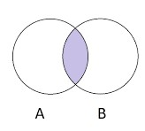

# Find relationships using set() in Python

To determind if there is a relationship between to entity, we use intersection of 2 sets:

in Python, this can be accomplished by:

a = list(A)  
b = list(B)

c = set(a).intersection(b)  
c is a list containinglemenst in the intersection.

## Building our relationship map by visiting

### We start with A, visit everyone down the list.  Found B.

We can create a relationship map as follows:

A_related = [A,B]  
B_related = [A,B]

### Next, with B, going down the list and found C.

The relationship list should add this new relationship and looks like:

B_related = [A,B, B,C]

To make the list unique and sort we do: sorted(set(B_related))

B_related = [A,B,C]

With this new found list, we should go update everyone in the list so that:

A_related = [A,B,C]  
B_related = [A,B,C]  
C_related = [A,B,C]

### Now, with C, going down the list and found D
The new relationship list should contain [A,B,C,D] for all members in A,B,C and D:  
A_related = [A,B,C,D]  
B_related = [A,B,C,D]  
C_related = [A,B,C,D]  
D_related = [A,B,C,D]

## Implementation and much better ways
My implementation of the method applying to Shoppee Code Challenge 2021: Multi-channel contacts: shoppee_walk.py

Information about this challenge can be found at: https://www.kaggle.com/c/scl-2021-da

### Using Dictionary
Dictionary has a build-in property much like set - the keys are unique.  When you assign another value to the same key, the value will be added to the list.

So, build a dictionary with Email, Phone and ContactId as the keys and Id as the value.  So now the starting relationship map looks like:

{'Email1': {A,B}, 'Phone123':{B,C}, 'ContactId45678':{C,D}....}

Now, we have relationship maps built based on same email, same phone number and same ContactId.  

Next, iterate over the keys and finding the intersection of the values to extract relatioship map.

rel_map ={}

{A,B} -- {B,C} -- set --> [A,B,C] 

